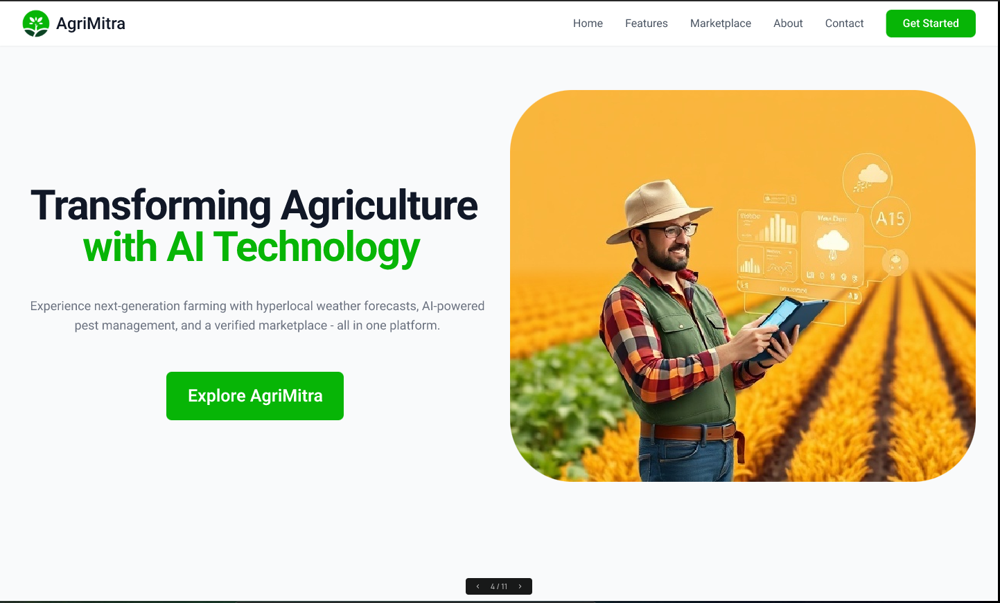
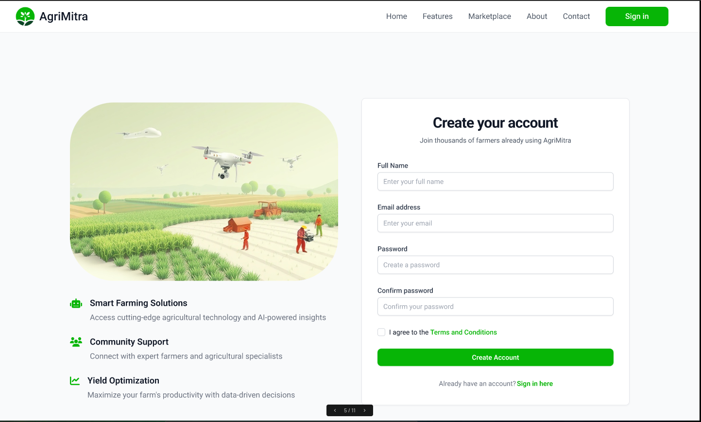
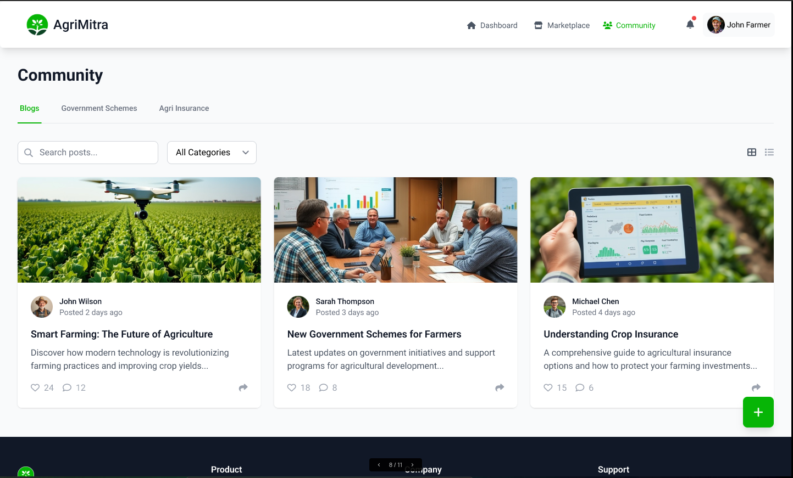
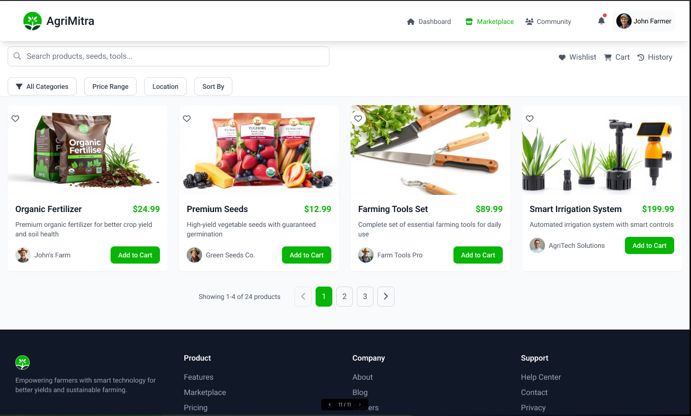

# AgriMitra

AgriMitra is a smart agriculture platform designed to empower farmers with AI-driven insights, real-time weather updates, market data, and access to government schemes. The project is built as part of the Google Solutions Challenge 2025 and leverages a modern, multi-platform architecture:

- **Frontend (Web):** React  
- **Frontend (Mobile):** Flutter  
- **Backend:** Firebase (Authentication, Firestore, Cloud Functions)  
- **AI & ML Integration:**  
  - **Google Gemini AI:** Provides personalized crop insights and recommendations.  
  - **Disease Detection ML Model:** Processes crop images to detect diseases.  
- **External APIs & Cloud Services:**  
  - **Google Weather API:** Delivers hyperlocal weather predictions.  
  - **Google Cloud:** Hosts microservices and supports cloud functionalities.

---

## Table of Contents

- [Features](#features)
- [Architecture](#architecture)
- [Installation](#installation)
  - [Prerequisites](#prerequisites)
  - [Setting Up the Web App](#setting-up-the-web-app)
  - [Setting Up the Mobile App](#setting-up-the-mobile-app)
  - [Setting Up the Firebase Backend](#setting-up-the-firebase-backend)
- [Usage](#usage)
- [Screenshots](#screenshots)
- [Contributing](#contributing)
- [License](#license)

---

## Features

- **AI-Driven Insights:**  
  - Hyperlocal weather alerts using Google Weather API.
  - Crop disease detection via a dedicated ML model.
  - Personalized recommendations powered by Google Gemini AI.

- **Marketplace:**  
  - Verified marketplace for seeds, tools, and agricultural products.
  - Real-time market price tracking.

- **Government Support:**  
  - Centralized hub for government schemes and agri insurance options.

- **Community Engagement:**  
  - Community blog feature where farmers share insights, experiences, and post blogs.
  - Like/Dislike functionality for blog posts.

- **User Management:**  
  - Secure authentication (Firebase Auth with Email/Google Sign-In).
  - Protected Dashboard with personalized data analytics.

---

## Architecture

The AgriMitra project follows a modular, scalable architecture:

- **Frontend (Web):**  
  - Built with React.
  - Interacts with Firebase for data storage and authentication.
  
- **Frontend (Mobile):**  
  - Built with Flutter for cross-platform mobile deployment.
  - Uses shared Firebase backend endpoints.

- **Backend:**  
  - **Firebase Cloud Functions (TypeScript):**  
    - Centralized business logic and API endpoints.
  - **Firestore:**  
    - Stores user data, blog posts, marketplace listings, and more.
  - **Firebase Auth:**  
    - Manages user authentication.
  
- **AI/ML Integration:**  
  - **Google Gemini AI:** For advanced analytics and crop recommendations.
  - **Disease Detection ML Model:** Processes crop images to detect early signs of disease.
  
- **External Services:**  
  - **Google Weather API:** Provides hyperlocal weather updates.
  - **Google Cloud:** Supports additional cloud operations.


---

## Installation

### Prerequisites

- [Node.js](https://nodejs.org/) (v14+ recommended)
- [Firebase CLI](https://firebase.google.com/docs/cli)  
- [Flutter SDK](https://flutter.dev/) for mobile app
- Git

### Setting Up the Web App

1. **Clone the Repository:**
   ```bash
   git clone https://github.com/Basharkhan7776/AgriMitra.git
   cd AgriMitra/web
   ```

2. **Install Dependencies:**
   ```bash
   npm install
   ```

3. **Configure Environment Variables:**

   Create a `.env` file in the `web` directory with your Firebase config:
   ```env
   VITE_API_KEY=your_api_key
   VITE_AUTH_DOMAIN=your_auth_domain
   VITE_PROJECT_ID=your_project_id
   VITE_STORAGE_BUCKET=your_storage_bucket
   VITE_MESSAGING_SENDER_ID=your_messaging_sender_id
   VITE_APP_ID=your_app_id
   ```

4. **Run the Web App:**
   ```bash
   npm run dev
   ```
   The app will be available at [http://localhost:3000](http://localhost:3000).

### Setting Up the Mobile App

1. **Navigate to the Mobile Folder:**
   ```bash
   cd ../mobile
   ```

2. **Install Flutter Dependencies:**
   ```bash
   flutter pub get
   ```

3. **Configure Firebase for Mobile:**
   - Follow the official [FlutterFire documentation](https://firebase.flutter.dev/docs/overview) to set up your Firebase configuration in your Flutter project (including `google-services.json` for Android and `GoogleService-Info.plist` for iOS).

4. **Run the Mobile App:**
   ```bash
   flutter run
   ```

### Setting Up the Firebase Backend

1. **Navigate to the Firebase Folder:**
   ```bash
   cd ../firebase
   ```

2. **Initialize Functions with TypeScript (if not already initialized):**
   ```bash
   firebase init functions
   ```
   - Choose TypeScript as your language.

3. **Install Dependencies and Build:**
   ```bash
   cd functions
   npm install
   npm run build
   ```

4. **Deploy Firebase Functions:**
   ```bash
   firebase deploy --only functions
   ```

5. **Configure Firestore Rules & Storage Rules as needed.**

---

## Usage

- **User Authentication:**  
  Users can sign up and sign in using email or Google authentication. The AuthContext ensures session persistence.
  
- **Dashboard & Community:**  
  Once authenticated, users access the Dashboard, where they can view AI-driven insights, ML stats, and community blog posts.
  
- **Creating Blog Posts:**  
  Authenticated users can create blog posts including image URL, title, description, and their name is auto-populated. Other users can like/dislike posts.
  
- **Marketplace:**  
  The platform offers a verified marketplace for seeds, tools, and agricultural products along with real-time market data.

---

## Screenshots

*Include screenshots of key parts of the project below:*

- **Dashboard:**  
  

- **Sign Up Page:**  
  

- **Community Blog:**  
  

- **Marketplace:**  
  


---

## Contributing

Contributions are welcome! Please follow these steps:

1. Fork the repository.
2. Create a feature branch.
3. Commit your changes.
4. Push your branch and open a pull request.

For major changes, please open an issue first to discuss what you would like to change.

---

## License

This project is licensed under the [MIT License](LICENSE).

---

## Contact

For any queries or contributions, please contact [Your Email] or open an issue on the GitHub repository.
